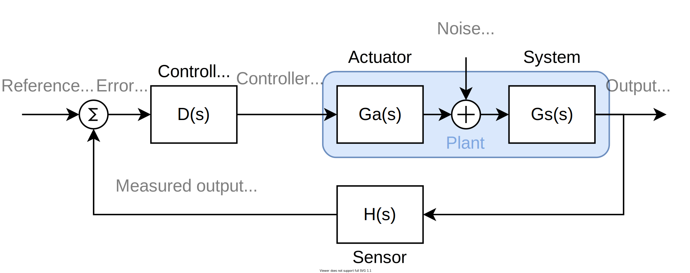

status :: #green 

# General feedback

\#modeling #feedback

By having feedback in a system, it is possible to dynamically adjust the amount of correction needed, depending on how the output is behaving. This is done by calculating an error signal $E(s)$ as the difference between the wanted reference value $R(s)$ and the measure output $Y_S(s)$. The job of the controller $D(s)$ is then to minimize the error signal.

## Important [Transfer Function](Transfer%20Function.md)s

The #direct-term can be found by "ignoring" any feedback. This means we only include the transfer functions of the controller and the plant.
$$\text{direct term} = D(s)G(s)$$

The #open-loop is like the direct term, but includes the transfer function of the sensor as well.
$$\text{open loop} = D(s)G(s)H(s)$$ 

Finally we have *probably* the most important transfer function in feedback:
$$\frac{Y(s)}{R(s)} = \frac{\text{direct term}}{1+\text{open loop}} = \frac{D(s)G(s)}{1+D(s)G(s)H(s)}$$
