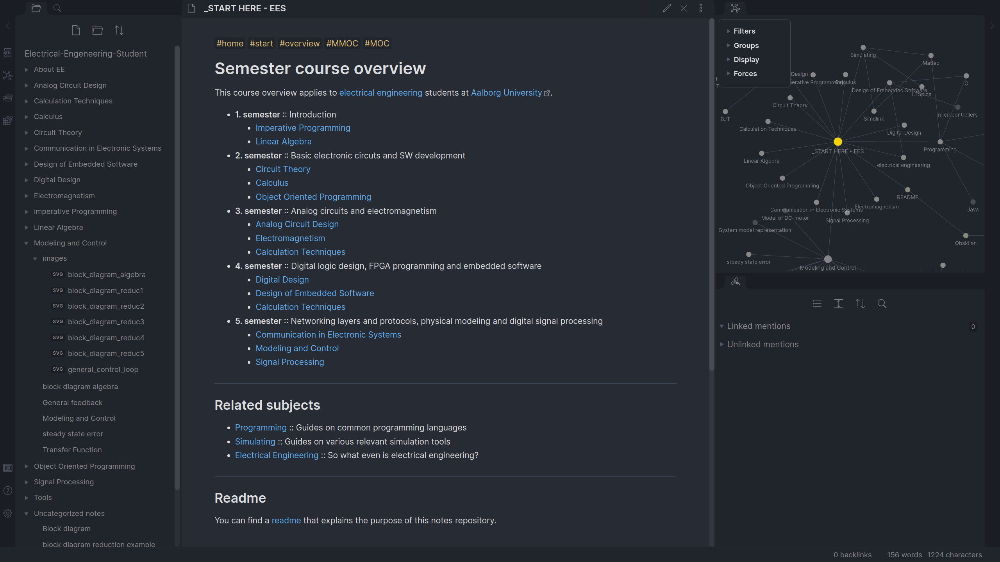

# EES-notes

**Large repository of notes for and by Electrical Engineering Students.**

Electrical Engineering was never the easiest path we could have taken in life. We knew that going in, but the alure of being able to design and implement highly technical devices, develop new and innovative solutions, control complex machines and solve the hardest of problems with electrical systems was simply too great. Being a student though, with the subjects we are required to master (or perhaps just pass), can be tough. A lot of knowledge has to enter our heads and hope fully stay there. For some, just long enough to pass the exam, and for others, long enough to make a career out of it. Whatever the reason, having access to good, traceable information is extremely important. 

To get started, visit the [START PAGE](START%20PAGE.md) and start browsing, learning and contributing!

#### Created with love, tears and coffee - Peter Krull

---

## Usage

To make more powerful connections between subjects and individual bits of knowledge, it has been written in the markdown language, with [Obsidian](0X%20Tools/Obsidian.md) linking in mind. This means, that whenever a complicated subject or bit of jargon is used in context, a link to the markdown file for that knowledge will be present. It is recommended to [download Obsidian](https://obsidian.md/download) to get the full experince, for free, but most things should work just fine using any markdown viewer.

---

###### Copyright notice

While there is no intent of copyright infringement with the publication of this set of notes, it is inevitable that there will be some overlap with the course material as well as the books that are used as references for the courses. If you find any obvious infringement, please let the maintainers of this repository know, so the infringement can be remedied.
